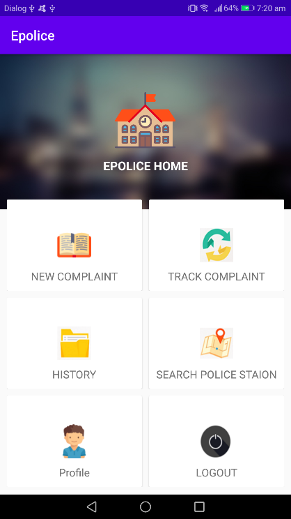
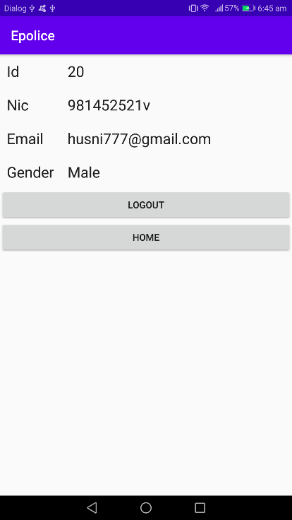
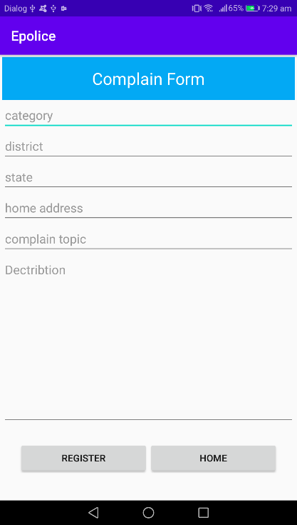
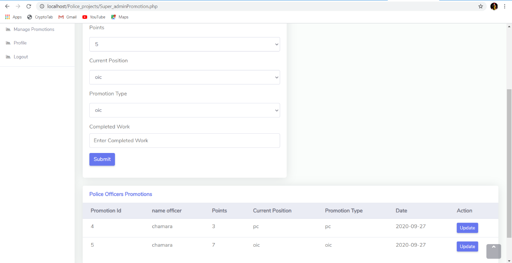
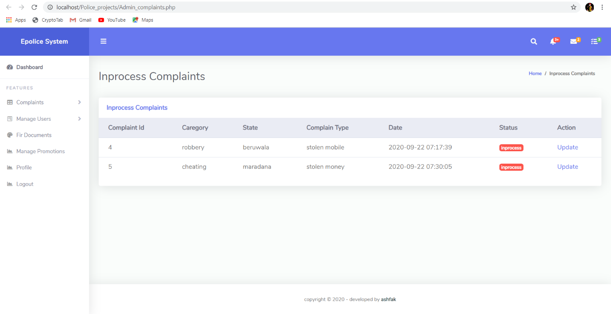
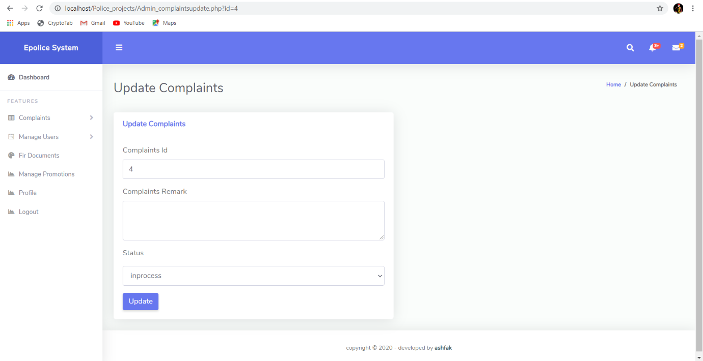

# Complaint-Management-System
Complaint Management System is developed to manage the police complaint activities. E-Police complaint mobile system and FIR registration with police officer promotions improvement points’ process has 2 system and one is web-based and another is an android application one for the victims and another for the police station.  This application developing using the NETBEANS IDE for the web-based application and MySQL as a database management system. And for the mobile application, for using the ANDROID STUDIO. This was my final year project. The code is free and open-source. 

# REST API Used
Rest API (Representational State Transfer) api’s are web standards base architecture and uses HTTP Protocol for exchanging data between applications or systems. In RESTFUL web service HTTP methods like GET, POST, PUT and DELETE can be used to perform CRUD operations.  REST is very simple compare to other methods like SOAP. We can get response in XML or in JSON but JSON is a light weight serialization language that is compatible with many different languages. JSON data parsing is very easy so most of app developer prefer this format.

# Features 
Mobile app:
* Dashboard
* Sign up
* Sign in/Sign out
* Victims can register complaints
* Track complaints
* View old complaints
* Search nearest police station

Web:
* Police officers can login as multiple roles
* Complaint management
* Fir document management 
* User management
* Officers promotions management

# Used Tools
* NetBeans 8.2
* Android Studio 4.0
* MySQL Server – XAMPP

# Follow the following steps:
1.	Download this project on your machine.
2.	Copy the web project and paste it to htdocs in xampp folder.
3.	Run the database and connect it to the NetBeans.
4.	Run the web project.
5.	After open the project in android studio.
6.	Check if any errors are there for library or dependencies
7.	Run the android project. 

# Some Mobile App Interfaces

 

 

# Some Web Interfaces

 

 

